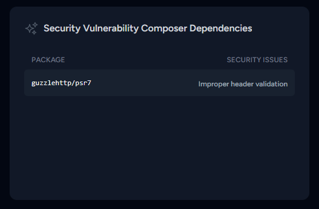

<p align="center"></p>

# Security Vulnerability Composer Dependencies card for Laravel Pulse

This card will show you security vulnerability composer dependencies.

## Installation

Require the package with Composer:

```shell
composer require hungthai1401/vulnerable
```

## Register the recorder

Right now, the Composer dependencies audit will only be checked once per day. To run the checks you must add the `Vulnerable` to the `pulse.php` file.

```diff
return [
    // ...
    
    'recorders' => [
+        \HT\Pulse\Vulnerable\Recorders\Vulnerable::class => [],
    ]
]
```

You also need to be running [the `pulse:check` command](https://laravel.com/docs/10.x/pulse#dashboard-cards).

## Add to your dashboard

To add the card to the Pulse dashboard, you must first [publish the vendor view](https://laravel.com/docs/10.x/pulse#dashboard-customization).

Then, you can modify the `dashboard.blade.php` file:

```diff
<x-pulse>
    ...
    
+    <livewire:vulnerable cols='4' rows='2' />
</x-pulse>
```
